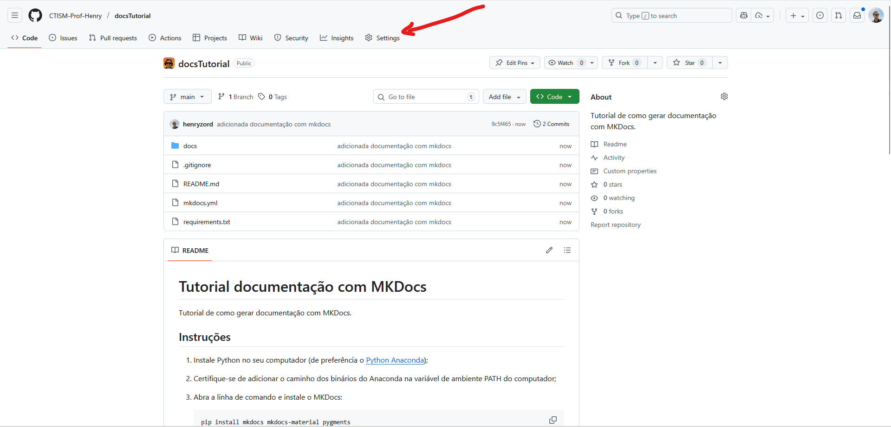
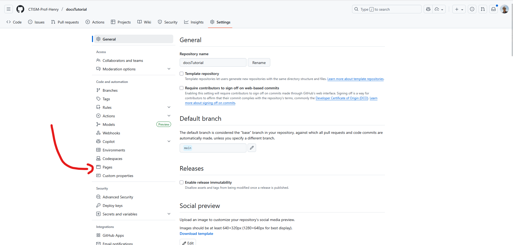
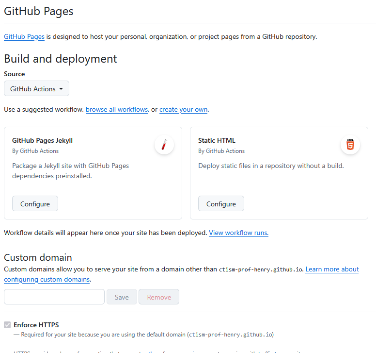

# Tutorial documentação com MKDocs

Tutorial de como gerar documentação com MKDocs.

## Instruções

1. Instale Python no seu computador (de preferência o [Python Anaconda](https://www.anaconda.com/download));
2. Certifique-se de adicionar o caminho dos binários do Anaconda na variável de ambiente PATH do computador;
3. Abra a linha de comando e instale o MKDocs:
   ```bash
   pip install mkdocs mkdocs-material pygments
   ```
   
4. Ainda na linha de comando, crie um novo projeto MKDocs a partir da pasta raiz do seu repositório:
   ```bash
   mkdocs new .
   ```
   
   **⚠️ NOTA:** Caso o comando não funcione, execute os comandos com `python -m`. Por exemplo, `python -m mkdocs new .`,
   `python -m mkdocs serve`, etc.

5. Será criado um diretório com essa configuração:
   ```
   mkdocs.yml    
   docs/         
   └── index.md  
   ```

6. Abra o o arquivo `mkdocs.yml` e configure da seguinte forma:
   ```yaml
   site_name: Tutorial Documentação com MKDocs
   theme: readthedocs
   markdown_extensions:
     - attr_list
     - footnotes
     - pymdownx.highlight:
         anchor_linenums: true
         line_spans: __span
         pygments_lang_class: true
     - pymdownx.inlinehilite
     - pymdownx.snippets
     - pymdownx.superfences
   ```

7. Existem dois comandos que podem ser usados agora:
   * `mkdocs serve` (desenvolvimento): inicia um servidor local para visualizar o site. As mudanças feitas na 
     documentação são refletidas no site.
   * `mkdocs build` (produção): gera as páginas em HTML.

8. Vamos usar o comando `mkdocs serve` para visualizar o site:
   ```bash
   mkdocs serve
   ```

9. Abra o navegador e acesse [http://127.0.0.1:8000](http://127.0.0.1:8000)
10. Altere o texto do arquivo `docs/index.md` e salve. Visualize novamente na URL [http://127.0.0.1:8000](http://127.0.0.1:8000) 
11. Existem muitas configurações que podem ser feitas a partir de agora: alterar o título do site, o tema, adicionar mais 
    páginas, dentre outros. Consulte a documentação oficial do MKDocs[^1] para mais informações.
12. Quando terminar, construa as páginas HTML com 
    
    ```bash
    mkdocs build
    ```

13. Crie um arquivo `requirements.txt` na pasta raiz do projeto, e escreva dentro dele
    ```
    mkdocs-material
    pygments
    mkdocs
    ```
    
14. Seu diretório deve ter essa aparência agora:
    ```
    mkdocs.yml          
    requirements.txt    
    docs/               
    └── index.md        
    ```

15. Salve o conteúdo do repositório no GitHub:
    
    ```bash
    git add .
    git commit -m "adicionada documentação com MKDocs"
    git push origin main
    ```
    
16. No repositório do GitHub, acesse as configurações, e no menu à esquerda, selecione GitHub Pages:

    
    

17. Mude os dados da página de maneira que eles fiquem como na seguinte figura:

    

18. Na pasta do seu repositório local, crie uma pasta `.github`. Dentro dela, crie outra pasta `workflow` e, dentro 
    desta, crie um arquivo `documentation.yml`:
    ```
    mkdocs.yml    
    requirements.txt    
    docs/         
    └── index.md  
    .github
    └── workflows
        └── documentation.yml
    ```
    
19. Dentro do arquivo `documentation.yml`, escreva o seguinte código-fonte:

    ```yaml
    name: documentation.yml
    on:
      push:
        branches:
          - main
    jobs:
      docs:
        runs-on: ubuntu-latest
        permissions:
          contents: 'read'
          pages: 'write'
          id-token: 'write'
        steps:
          - name: Clona repositório no servidor remoto do GitHub
            uses: actions/checkout@v5
            
          - name: Configura o interpretador Python
            uses: actions/setup-python@v4
            with:
              python-version: '3.x'
              
          - name: Instala bibliotecas Python
            run: |
              python -m pip install --upgrade pip
              pip install --requirement requirements.txt
              
          - name: Constrói páginas HTML com MKDocs
            run: mkdocs build
            
          - name: Transfere páginas HTML para o GitHub Pages
            uses: actions/configure-pages@v3
    
          - name: Upload artifact
            uses: actions/upload-pages-artifact@v3
            with:
              path: 'site/'
    
          - name: Publica páginas HTML
            id: deployment
            uses: actions/deploy-pages@v4
            env:
              GITHUB_TOKEN: ${{ secrets.GITHUB_TOKEN }}
    ```

20. Salve e envie os arquivos para o repositório remoto do GitHub:

    ```bash
    git add .
    git commit -m "adicionado pipe do GitHub actions para deploy de documentação no GitHub pages"
    git push origin main
    ```
    
21. Pronto! Se tudo deu certo, sua documentação deve estar disponível em 
    
    ```
    https://<nome do proprietário do repositório>.github.io/<nome do repositório>
    ```

22. Por exemplo, este repositório está armazenado em 
    [https://ctism-prof-henry.github.io/docsTutorial](https://ctism-prof-henry.github.io/docsTutorial)


# Recursos adicionais

[^1]: [Tutorial MKDocs](https://www.mkdocs.org/getting-started)
